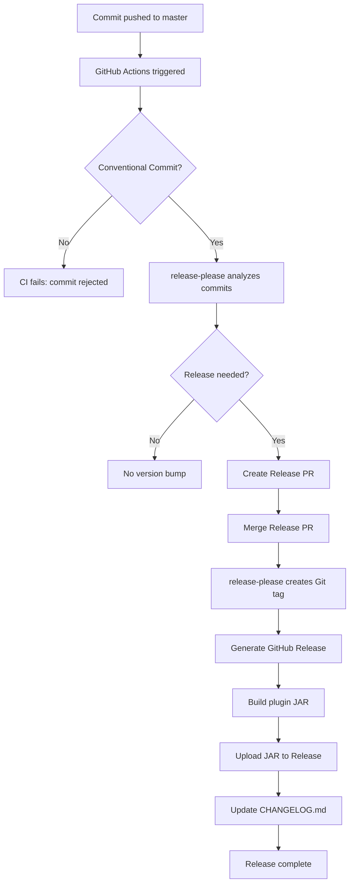

# Release Process

This project uses a fully automated release pipeline powered by:

- Conventional Commits
- release-please
- GitHub Actions
- Automatic changelog generation
- Automatic version tagging
- Automatic GitHub Releases
- Automatic JAR upload

The goal is to ensure consistent, auditable, and low-friction releases.

---

## 1. Commit Messages

All commits must follow the **Conventional Commits** specification:

<type>(optional scope): <description>

Examples:

- `feat(queue): add throughput chart`
- `fix(router): correct hash routing`
- `docs: update installation instructions`

These commit messages determine:

- whether a release is needed  
- the next version number (major/minor/patch)  
- the changelog entries  

---

## 2. Triggering a Release

A release is triggered automatically when:

- a commit is pushed to the `master` branch  
- AND the commit contains a `feat:` or `fix:` or any other relevant type  

release-please will:

1. Analyze commit history  
2. Determine if a new version is required  
3. Create a **Release PR**  
4. Update `CHANGELOG.md`  
5. Propose a version bump  

When the Release PR is merged:

- a Git tag is created (e.g., `v1.3.0`)  
- a GitHub Release is published  
- release notes are generated  
- the plugin JAR is built and uploaded  

---

## 3. GitHub Actions Workflow

The release workflow performs:

- release-please analysis  
- version bump  
- changelog update  
- tag creation  
- GitHub Release creation  
- Maven build  
- JAR upload  

The workflow file is located at: .github/workflows/release.yml

---

## 4. Artifacts

Each release includes:

- The generated JAR file  
- Auto-generated release notes  
- Updated changelog  
- Version tag  

---

## 5. Manual Releases (Optional)

If needed, you can still create a manual release:

1. Go to **GitHub → Releases → Draft a new release**  
2. Choose a tag or create a new one  
3. Add release notes  
4. Upload the JAR manually  

Manual releases are discouraged unless necessary.

---

## 6. Summary Diagram

## 7. Philosophy
This release pipeline is designed to be:
- Predictable
- Auditable
- Low-noise
- Fully automated
- Aligned with modern open-source standards

No manual tagging.
No manual changelog editing.
No manual artifact uploads.

Everything flows from clean commit messages.